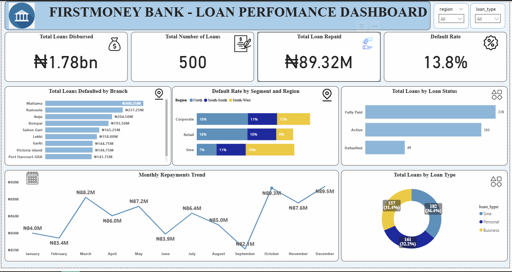

# Loan Performance Analysis — FirstMoney Bank

**Tools:** Microsoft Excel, Power BI, PostgreSQL  
**Core Competencies:** Data Cleaning, Relational Database Queries (JOINs, CTEs), Trend Analysis, Stakeholder Reporting

---

## Project Overview

FirstMoney Bank operates 10 retail branches across Lagos, Abuja, Port Harcourt, and Kano. Following a 12% spike in loan defaults last quarter, the Head of Retail Banking commissioned an urgent review of the bank's loan and repayment data for the past year.

This project analyses 500 loan records across customer, branch, repayment, and staff datasets to diagnose the root causes of the default spike and recommend actionable changes.

---

## Technical Workflow & Methodology

To process and analyze the data effectively, I utilized a multi-tool pipeline:

*   **Data Cleaning & Structuring (Microsoft Excel):** Processed the raw datasets to handle missing values, standardize text formats, and establish clean data tables required for accurate reporting.
*   **Data Visualization (Power BI):** Ingested the cleaned Excel data to build an interactive dashboard using DAX. This provided stakeholders with a high-level view of default rates, disbursement volumes, and regional performance.
*   **Business Analysis (PostgreSQL):** Imported the data into a relational database to answer targeted business questions. I executed specific SQL queries to:
    *   Calculate exact default rates per branch using Common Table Expressions (CTEs).
    *   Evaluate Relationship Manager performance against financial targets.
    *   Identify credit risk across specific customer segments and geographic regions using multi-table JOINs.
    *   Track month-over-month repayment trends.

*(The complete SQL script detailing these queries is located in the `Loan_Performance_SQL_Scripts` folder).*

---

## Key Findings

*   **Overall Default Rate:** 13.8% (69 out of 500 loans unpaid).
*   **Primary Risk Driver:** SME loans account for 36.4% of the portfolio with an 18% default rate.
*   **Geographic Vulnerability:** The North region is the worst-performing. Specific Relationship Managers show default rates of 22–35%.
*   **Underperforming Branches:** Sabon Gari branch holds the highest branch-level default rate at 20%, despite having half the disbursement volume of the top branch.
*   **High-Value Exposure:** Maitama branch disburses the most (₦300M+). An 11% default rate here equals ₦42M in bad loans.
*   **Repayment Volatility:** Collections hit an all-time low in September (₦8.2M) and peaked in October and December (₦89M+).

---

## Strategic Recommendations

1.  Cap SME loan exposure in the North region until default rates stabilize.
2.  Restructure Relationship Manager targets to weight repayment quality, rather than pure disbursement volume.
3.  Place the Sabon Gari branch under a performance improvement plan.
4.  Investigate the September repayment dip to determine ties to loan maturity clustering or seasonal factors.

---

## Project Files

*   **[View the Complete SQL Script](Loan_Performance_SQL_Scripts/Firstmoney_SQL_Script.sql)**
*   **[View the Case Study Presentation](Loan_Performance_Presentation/FirstMoney_Loan_Performance_Presentation_slides.pdf)**

